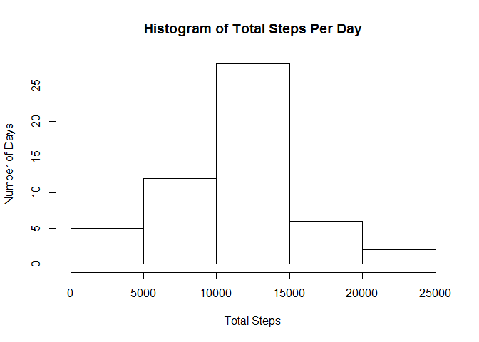

# Reproducible Research: Peer Assessment 1


## Loading and preprocessing the data


```r
data <- read.csv(unzip("activity.zip"))
names(data) #checking the variables we have
```

```
## [1] "steps"    "date"     "interval"
```

```r
nrow(data) #checking how many observatons we have
```

```
## [1] 17568
```

```r
data$date <- as.Date(data$date) #getting the dates to the right format
startDate <- data$date[1] #getting the start date
endDate <- data$date[17568] #getting the end date
n <- as.integer(endDate - startDate) #getting number of days
```

## What is mean total number of steps taken per day?

```r
totalSteps <- vector() #initializing the data frame
for(i in 0:n) {
  totalSteps <- rbind(totalSteps, c(sum(data$steps[data$date == startDate+i]),1+i))
}
mean(totalSteps[,1], na.rm = TRUE) #mean total number of steps taken per day, removing the NA values
```

```
## [1] 10766.19
```

## What is the average daily activity pattern?

```r
hist(totalSteps[,1], main = "Histogram of Total Steps Per Day", xlab = "Total Steps", ylab = "Number of Days")
```

 

## Imputing missing values


## Are there differences in activity patterns between weekdays and weekends?
